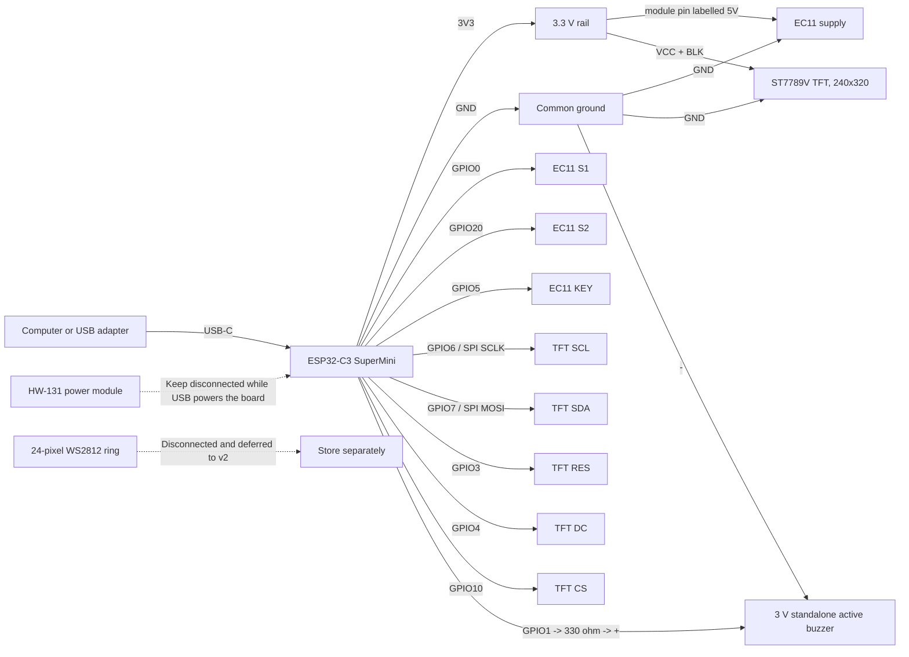

# Focus timer prototype wiring

This is the reconstruction reference for the current USB-powered breadboard
prototype. Wire colours are deliberately omitted: follow the labels printed on
the modules and controller, because Dupont-wire colours are not electrical
identifiers.

## Current SuperMini + TFT profile



## Exact pin-to-pin list

| Subsystem | From | To | Status / notes |
| --- | --- | --- | --- |
| Controller power | Computer or USB adapter | Controller USB-C connector labelled `USB` | The only prototype power source |
| TFT power | Controller `3V3` | TFT `VCC` and `BLK` | Verified at 3.3 V; do not use a second supply |
| TFT ground | Controller `GND` | TFT `GND` | Common ground |
| TFT clock | Controller GPIO6 | TFT `SCL`/`SCLK` | SPI2 SCLK, mode 3 at 26 MHz |
| TFT data | Controller GPIO7 | TFT `SDA`/`MOSI` | SPI2 write-only MOSI |
| TFT reset | Controller GPIO3 | TFT `RES` | Active-low reset |
| TFT data/command | Controller GPIO4 | TFT `DC` | GPIO output |
| TFT chip select | Controller GPIO10 | TFT `CS` | Hardware chip select |
| Encoder power | Controller `3V3` | EC11 module pin labelled `5V` | Intentional: keeps its pull-ups at 3.3 V |
| Encoder ground | Controller `GND` | EC11 `GND` | Common ground |
| Encoder phase A | Controller GPIO0 | EC11 `S1` | Bench-verified |
| Encoder phase B | Controller GPIO20 | EC11 `S2` | Physically verified; clockwise remains `RotateRight` |
| Encoder switch | Controller GPIO5 | EC11 `KEY` | Bench-verified |
| External LED ring | Not connected | Store the WS2812 ring separately | Deferred; GPIO10 now belongs to TFT CS |
| Buzzer positive | Controller GPIO1 | 330 ohm resistor, then standalone active-buzzer `+` | Bench-verified; current limited to at most approximately 10 mA |
| Buzzer negative | Active-buzzer `-` | Controller `GND` | Common ground; do not use the passive buzzer |
| HW-131 power module | Not connected | Nothing | Do not parallel it with USB power |

The delivered TFT header labels are `GND`, `VCC`, `SCL`, `SDA`, `RES`, `DC`,
`CS`, `BLK`. Despite the `SDA` label, this four-wire display uses SPI, not I2C.
The EC11 module's observed rear pin order is `5V`, `KEY`, `S2`, `S1`, `GND`.
The ring pads are `DI`, `5V`, `GND`, `DO`.

## Controller header locator

Use the labels printed on the SuperMini PCB rather than wire colour or a
photograph's orientation. The production allocation is:

```text
GPIO0  EC11 S1          GPIO6   TFT SCL/SCLK
GPIO1  buzzer +         GPIO7   TFT SDA/MOSI
GPIO3  TFT RES          GPIO10  TFT CS
GPIO4  TFT DC           GPIO20  EC11 S2
GPIO5  EC11 KEY         3V3     TFT VCC + BLK + EC11 supply
GND    common return

Reserved: GPIO2/GPIO8/GPIO9 (boot straps), GPIO18/GPIO19 (native USB),
GPIO21 (future measurement/power work).
```

## Safe reconstruction order

1. Disconnect USB and every other power source before soldering or moving
   controller headers.
2. Reflow and inspect the controller header joints, especially GPIO3, GPIO4,
   GPIO6, GPIO7, GPIO10, and GPIO20.
   Check that no solder bridge joins adjacent pins.
3. Connect only the TFT's eight labelled connections and power-cycle the
   controller. Accept this stage only when `tft-diagnostic` animates without
   seams, black flashes, or reset logs.
4. Disconnect USB, add the EC11's five wires, reconnect USB, and repeat the
   encoder direction/button diagnostic.
5. Leave the external LED ring and its capacitors disconnected. They are not
   part of this prototype; GPIO10 is reserved for TFT CS.
6. Disconnect USB, insert one 330 ohm resistor between GPIO1 and the standalone
   active buzzer's marked `+`, then connect its `-` to common GND. Reconnect USB
   and confirm both Start and Complete cadences. Keep HW-131 disconnected.

## Transfer to soldered perfboard

The validated circuit can be transferred without changing its electrical
topology. The transfer is a mechanical rebuild, not an opportunity to add the
deferred ring, battery input, HW-131, or a second power source.

1. Prefer sockets or female headers for the controller and TFT so both remain
   replaceable. Keep the antenna edge clear and both USB-C connectors accessible.
2. Create one labelled `3V3` rail and one common `GND` rail. Do not create or
   connect a 5 V peripheral rail for this MVP.
3. Keep the GPIO6/SCLK and GPIO7/MOSI pair short and mechanically support the
   TFT connector so no force reaches its solder joints.
4. Place the 330 ohm resistor in series close to GPIO1 or the buzzer connector;
   preserve buzzer polarity.
5. Before applying USB power, inspect both sides under good light and verify
   continuity for every row in the pin-to-pin table. Verify there is no short
   between `3V3` and `GND`, no bridge between adjacent controller pins, and no
   unintended connection to 5 V, GPIO2, GPIO8, GPIO9, GPIO18, or GPIO19.
6. Power up in the same stages used on the breadboard: controller alone, TFT,
   encoder, then buzzer. Stop immediately on heat, resets, unstable display, or
   unexpected buzzer activation.
7. Flash the default production build and repeat selection, short press, pause,
   resume, long-press cancel, completion feedback, reboot-to-Idle, and NVS
   restore. The perfboard assembly is accepted only after this smoke test.

The whole-device USB current was not captured with an inline meter. Keep the
load identical during transfer; measure it before adding a battery system,
addressable LEDs, or any other peripheral.

## Validation status

- EC11: the SuperMini GPIO0/GPIO20/GPIO5 pin map, clockwise/right direction,
  short press, and long press are bench-verified with continuous TFT animation.
- WS2812: earlier direct-GPIO diagnostics are preserved as historical evidence,
  but the reworked oversized ring is now disconnected and excluded from MVP
  acceptance. A smaller replacement will receive a fresh power/signal review.
- TFT: the delivered 2.0-inch ST7789V module is electrically verified at 3.3 V,
  SPI mode 3 and 26 MHz. The shared row-buffered diagnostic rendered a seamless
  procedural background at about 6.9 FPS without a full-screen framebuffer.
  The combined production runtime boots BLE, NVS, journal, and the isolated TFT
  worker. The combined 8-second acceptance run passed selection, start, pause,
  resume, completion, dismissal, and cancellation on GPIO20 without a reset.
- Buzzer: the standalone 3 V active buzzer on GPIO1 through 330 ohm produced the
  short Start and three-pulse Complete cadences at usable volume. The direct,
  current-limited path is accepted for the prototype; no transistor is required.

`74HC595` and `4N35` are not part of this wiring. Neither is a suitable future
WS2812 data buffer. Level shifting and power conditioning will be reconsidered
when a replacement ring is selected.
