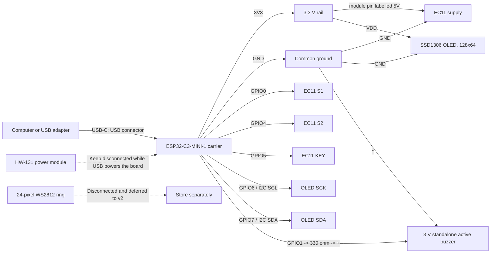

# Focus timer prototype wiring

This is the reconstruction reference for the current USB-powered breadboard
prototype. Wire colours are deliberately omitted: follow the labels printed on
the modules and controller, because Dupont-wire colours are not electrical
identifiers.

## Connection overview



## Exact pin-to-pin list

| Subsystem | From | To | Status / notes |
| --- | --- | --- | --- |
| Controller power | Computer or USB adapter | Controller USB-C connector labelled `USB` | The only prototype power source |
| OLED power | Controller `3V3` | OLED `VDD` | Use 3.3 V, not 5 V |
| OLED ground | Controller `GND` | OLED `GND` | Common ground |
| OLED clock | Controller GPIO6 | OLED `SCK` | I2C SCL |
| OLED data | Controller GPIO7 | OLED `SDA` | I2C SDA; electrically bench-verified, mechanically fragile Dupont/header contact |
| Encoder power | Controller `3V3` | EC11 module pin labelled `5V` | Intentional: keeps its pull-ups at 3.3 V |
| Encoder ground | Controller `GND` | EC11 `GND` | Common ground |
| Encoder phase A | Controller GPIO0 | EC11 `S1` | Bench-verified |
| Encoder phase B | Controller GPIO4 | EC11 `S2` | Bench-verified |
| Encoder switch | Controller GPIO5 | EC11 `KEY` | Bench-verified |
| External LED ring | Not connected | Store the WS2812 ring separately | Deferred to v2; GPIO10 and `5V out` remain unused by the MVP |
| Buzzer positive | Controller GPIO1 | 330 ohm resistor, then standalone active-buzzer `+` | Bench-verified; current limited to at most approximately 10 mA |
| Buzzer negative | Active-buzzer `-` | Controller `GND` | Common ground; do not use the passive buzzer |
| HW-131 power module | Not connected | Nothing | Do not parallel it with USB power |

The OLED module's observed front pin order is `GND`, `VDD`, `SCK`, `SDA`.
The EC11 module's observed rear pin order is `5V`, `KEY`, `S2`, `S1`, `GND`.
The ring pads are `DI`, `5V`, `GND`, `DO`.

## Controller header locator

View the controller with the antenna at the top and both USB-C connectors at
the bottom. Only the pins used by this prototype are annotated below.

```text
                    ANTENNA

left header                         right header
-----------                         ------------
GND                                 GND
3V3  -> OLED VDD + EC11 supply      TX / GPIO21
3V3                                 RX / GPIO20
GPIO2                               GND
GPIO3                               GPIO9
GND                                 GPIO8 / onboard RGB
RST                                 GND
GND                                 GPIO7 -> OLED SDA
GPIO0 -> EC11 S1                    GPIO6 -> OLED SCK
GPIO1 -> 330R -> active buzzer +    GPIO5 -> EC11 KEY
GPIO10 -> unused (ring deferred)    GPIO4 -> EC11 S2
GND                                 GND
5V out -> unused                    GPIO18 / USB D-
5V in, leave disconnected           GPIO19 / USB D+
GND                                 GND

                 USB-C COM   USB-C USB
```

## Safe reconstruction order

1. Disconnect USB and every other power source before soldering or moving
   controller headers.
2. Reflow and inspect the controller header joints, especially GPIO6 and GPIO7.
   Check that no solder bridge joins adjacent pins.
3. Connect only the OLED's four wires and power-cycle the controller. Accept
   this stage only when all four diagnostic screens keep cycling without
   touching the wires.
4. Disconnect USB, add the EC11's five wires, reconnect USB, and repeat the
   encoder direction/button diagnostic.
5. Leave the external LED ring, its capacitors, GPIO10, and `5V out`
   disconnected. They are not part of the MVP reconstruction.
6. Disconnect USB, insert one 330 ohm resistor between GPIO1 and the standalone
   active buzzer's marked `+`, then connect its `-` to common GND. Reconnect USB
   and confirm both Start and Complete cadences. Keep HW-131 disconnected.

## Transfer to soldered perfboard

The validated circuit can be transferred without changing its electrical
topology. The transfer is a mechanical rebuild, not an opportunity to add the
deferred ring, battery input, HW-131, or a second power source.

1. Prefer sockets or female headers for the controller and OLED so both remain
   replaceable. Keep the antenna edge clear and both USB-C connectors accessible.
2. Create one labelled `3V3` rail and one common `GND` rail. Do not create or
   connect a 5 V peripheral rail for this MVP.
3. Keep GPIO6/SCK and GPIO7/SDA short, routed together, and away from the buzzer
   branch. Mechanically support the OLED connector so no force reaches its four
   solder joints.
4. Place the 330 ohm resistor in series close to GPIO1 or the buzzer connector;
   preserve buzzer polarity.
5. Before applying USB power, inspect both sides under good light and verify
   continuity for every row in the pin-to-pin table. Verify there is no short
   between `3V3` and `GND`, no bridge between adjacent controller pins, and no
   connection to `5V in`, `5V out`, GPIO10, GPIO18, or GPIO19.
6. Power up in the same stages used on the breadboard: controller alone, OLED,
   encoder, then buzzer. Stop immediately on heat, resets, unstable display, or
   unexpected buzzer activation.
7. Flash the default production build and repeat selection, short press, pause,
   resume, long-press cancel, completion feedback, reboot-to-Idle, and NVS
   restore. The perfboard assembly is accepted only after this smoke test.

The whole-device USB current was not captured with an inline meter. Keep the
load identical during transfer; measure it before adding a battery system,
addressable LEDs, or any other peripheral.

## Validation status

- EC11: pin map, direction, short press, and long press are bench-verified.
- WS2812: earlier direct-GPIO diagnostics are preserved as historical evidence,
  but the reworked oversized ring is now disconnected and excluded from MVP
  acceptance. A smaller replacement will receive a fresh power/signal review.
- OLED: `0x3C` ACK at 100 kHz with ESP32-C3 internal 3.3 V pull-ups; upright
  `READY`, `FOCUS`, `PAUSED`, and `COMPLETE` frames repeatedly cycled and were
  readable at desk distance. The loose Dupont/header contact is the primary
  mechanical defect the soldered transfer must eliminate.
- Buzzer: the standalone 3 V active buzzer on GPIO1 through 330 ohm produced the
  short Start and three-pulse Complete cadences at usable volume. The direct,
  current-limited path is accepted for the prototype; no transistor is required.

`74HC595` and `4N35` are not part of this wiring. Neither is a suitable future
WS2812 data buffer. Level shifting and power conditioning will be reconsidered
when a replacement ring is selected.
